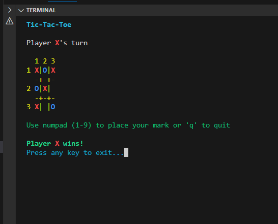

# 🎮 Tic-Tac-Toe

A classic **Tic-Tac-Toe** game played right in your terminal!  
Enjoy a simple two-player game with a visually clean and colorful display.



---

## 🕹️ How to Play

- The game is played on a **3×3** grid.
- Two players take turns: **Player X** and **Player O**.
- Use your **numpad keys (1–9)** to place your mark:
  
  ```
  7 | 8 | 9
  --+---+--
  4 | 5 | 6
  --+---+--
  1 | 2 | 3
  ```

- Press **'q'** anytime to quit the game.

---

## ✅ Features

- Color-coded terminal UI
- Clear instructions for players
- Victory detection and friendly exit prompt
- Written in C++ (or specify your language)

---

## 🛠️ How to Run

1. Clone this repository:
   ```bash
   git clone https://github.com/your-username/tic-tac-toe-terminal.git
   cd tic-tac-toe-terminal
   ```

2. Compile and run:
   ```bash
   g++ main.cpp -o tictactoe
   ./tictactoe
   ```

   > Make sure you have a C++ compiler installed.

---

## 📸 Screenshot


---